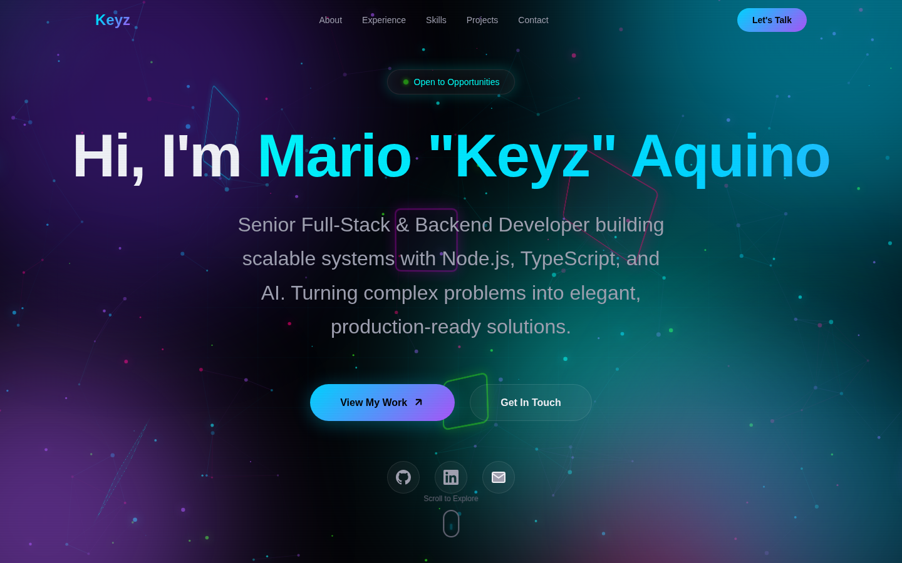

# KeyzPortfolio

Personal portfolio of **Mario "Keyz" Aquino** — Senior Full-Stack & Backend Developer.



**Live:** https://marigiko.github.io/KeyzPortfolio/ (also at https://keyz.dev once DNS is configured)

## Tech highlights

- **HTMX 2.0** — dynamic interactions without heavy JS frameworks
- **CSS Scroll-Driven Animations** — `animation-timeline: view()` with `animation-range`
- **CSS View Transition API** — smooth page transitions
- **CSS Houdini @property** — hardware-accelerated custom properties
- **Advanced 3D CSS** — `perspective`, `transform-style: preserve-3d`, individual transform properties
- **Cyberpunk/Neon aesthetic** — electric blue, cyan, magenta with glassmorphism

Fully static — no build step, no server required. Deployed to GitHub Pages on every push to `main` via [`.github/workflows/pages.yml`](.github/workflows/pages.yml).

## Quick Start

```bash
# Serve locally
python3 -m http.server 8080
# Open http://localhost:8080
```

## Structure

```
├── index.html          # Main HTML with semantic sections
├── content.json        # Structured portfolio content
├── styles/
│   ├── main.css        # Core styles, scroll animations, view transitions
│   ├── 3d-effects.css  # 3D transforms, parallax, floating objects
│   ├── htmx.css        # HTMX states and loading animations
│   └── polish.css      # Custom cursor, loading screen, scroll progress
├── js/
│   └── enhancements.js # HTMX engine, tilt, parallax, particles
└── docs/
    └── screenshot.png  # Site preview
```

## License

- **Code:** [MIT](LICENSE)
- **Content** (copy, project descriptions, personal info in `content.json`): all rights reserved — see [LICENSE](LICENSE) notice.

## Contact

- Email: marioaquinojob@gmail.com
- LinkedIn: [keyzdev](https://www.linkedin.com/in/keyzdev)
- GitHub: [@Marigiko](https://github.com/Marigiko)
